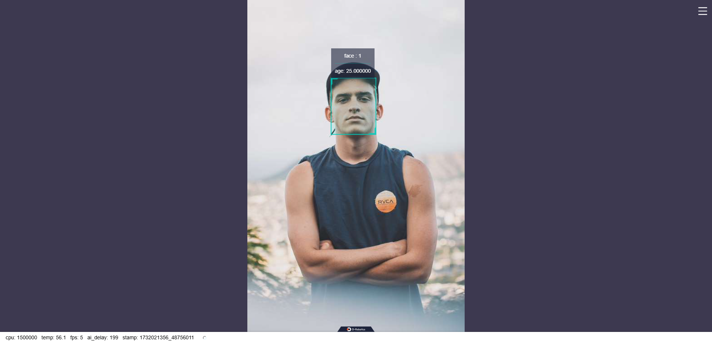

# face_age_detection

English| [简体中文](./README_CN.md)

## Description

Face Age Detection Package

## Supported Platforms

| Material Name   | Manufacturer | Reference Links                                                                                                                                             |
| :-------------- | ------------ | ----------------------------------------------------------------------------------------------------------------------------------------------------------- |
| RDK X3 / RDK X5 | Multiple     | [RDK X3](https://developer.d-robotics.cc/rdkx3)<br>[RDK X5](https://developer.d-robotics.cc/rdkx5)                                                          |
| Camera          | Multiple     | [MIPI Camera](https://developer.horizon.cc/nodehubdetail/168958376283445781)<br>[USB Camera](https://developer.horizon.cc/nodehubdetail/168958376283445777) |

## Building

- Building depends on [ai_msgs](https://github.com/D-Robotics/hobot_msgs)
- Building depends on [hobot_dnn](https://github.com/D-Robotics/hobot_dnn)

```shell
# Cross-compilation for X5
bash build.sh -p X5 -s img_msgs
bash build.sh -p X5 -s hbm_img_msgs
bash build.sh -p X5 -s ai_msgs
bash build.sh -p X5 -s dnn_node
bash build.sh -p X5 -s face_age_detection
```

## Running Instructions

1. Start the body, face, hand detection algorithms, and age detection algorithm:

```shell
===============================================================================================================================
# Load the tros.b environment
source /opt/tros/humble/setup.bash
source ./install/local_setup.bash
===============================================================================================================================
# Offline Inference
ros2 launch face_age_detection face_age_det_node.launch.py feed_type:=1 feed_image_path:=image.png roi_xyxy:=x1,y1,x2,y2,x3,y3,x4,y4,...

# For example
ros2 launch face_age_detection face_age_det_node.launch.py feed_type:=1 feed_image_path:=image.png roi_xyxy:=251,242,328,337
===============================================================================================================================
# Online Inference, requires simultaneous launch of body detection and age detection nodes
cp -r /opt/tros/${TROS_DISTRO}/lib/mono2d_body_detection/config/ .

# For USB camera
export CAM_TYPE=usb
# For MIPI camera
export CAM_TYPE=mipi

# Launch the launch file
ros2 launch face_age_detection body_det_face_age_det.launch.py
===============================================================================================================================
```

2. Start the body, face, hand detection algorithms, hand gesture recognition algorithm, and age detection algorithm, and use the [tros_perception_fusion node](https://github.com/D-Robotics/tros_perception_common/tree/develop/tros_perception_fusion) to fuse all perception results:

```shell
# Load the tros.b environment
source /opt/tros/humble/setup.bash
source ./install/local_setup.bash

# Copy the required resource files to the current directory
cp -r /opt/tros/${TROS_DISTRO}/lib/mono2d_body_detection/config/ .
cp -r /opt/tros/${TROS_DISTRO}/lib/hand_lmk_detection/config/ .
cp -r /opt/tros/${TROS_DISTRO}/lib/hand_gesture_detection/config/ .

# For USB camera
export CAM_TYPE=usb
# For MIPI camera
export CAM_TYPE=mipi

# Launch the launch file
ros2 launch face_age_detection age_gesture_fusion.launch.py max_slide_window_size:=100
```

## Running Results

Outputs the detected age.



## Package Parameters

| Name                  | Default Value        | Description                                                                                                                                           |
| --------------------- | -------------------- | ----------------------------------------------------------------------------------------------------------------------------------------------------- |
| feed_type             | 0                    | 0: Real-time inference using camera-captured images, 1: Offline inference using static images                                                         |
| feed_image_path       | ./config/image.png   | Input image, in formats such as png, jpg, etc.                                                                                                        |
| is_sync_mode          | 0                    | 0: Asynchronous inference, 1: Synchronous inference                                                                                                   |
| model_file_name       | ./config/faceAge.hbm | Model file                                                                                                                                            |
| is_shared_mem_sub     | 1                    | 0: Do not use shared memory communication, 1: Use shared memory communication                                                                         |
| dump_render_img       | 0                    | 0: Do not save rendered images, 1: Save rendered images                                                                                               |
| ai_msg_pub_topic_name | /face_age_detection  | Topic name for publishing ai_msg, only used for real-time inference                                                                                   |
| max_slide_window_size | 15                   | Maximum length of the voting queue. Ages are saved into the queue during continuous inference, and the age with the most votes is taken as the result |

